# CHAPTER 2: REQUIREMENT ANALYSIS

## Introduction

This chapter outlines the requirements necessary for the successful development and deployment of the WasteApp application – a smart waste management solution for urban communities. It aims to understand the current waste collection processes, their limitations, and how the WasteApp can address these challenges effectively. To achieve this, use case diagrams and activity diagrams are used to represent the interactions between users and the system. Additionally, various scenarios are analyzed to highlight the key functionalities and user expectations for the application. These visual tools provide a comprehensive understanding of the system's requirements and guide the design and development phases of the project.

---

## Use Case Diagram

```mermaid
graph TB
    subgraph System["WasteApp System"]
        UC1["Sign Up"]
        UC2["Log In"]
        UC3["View Dashboard"]
        UC4["Request Waste Pickup"]
        UC5["View Collection Schedule"]
        UC6["Report Waste Issue"]
        UC7["View Rewards"]
        UC8["Manage Profile"]
        UC9["View Notifications"]
        UC10["View Assigned Tasks"]
        UC11["Update Pickup Status"]
        UC12["View Route Map"]
        UC13["Track Live Location"]
        UC14["Manage Citizens"]
        UC15["Manage Drivers"]
        UC16["Manage Schedules"]
        UC17["View Reports & Analytics"]
        UC18["Handle Issues"]
        UC19["View Map Overview"]
        UC20["System Settings"]
    end

    Citizen((Citizen))
    Driver((Driver))
    Admin((Admin))

    Citizen --> UC1
    Citizen --> UC2
    Citizen --> UC3
    Citizen --> UC4
    Citizen --> UC5
    Citizen --> UC6
    Citizen --> UC7
    Citizen --> UC8
    Citizen --> UC9

    Driver --> UC2
    Driver --> UC10
    Driver --> UC11
    Driver --> UC12
    Driver --> UC13
    Driver --> UC8

    Admin --> UC2
    Admin --> UC14
    Admin --> UC15
    Admin --> UC16
    Admin --> UC17
    Admin --> UC18
    Admin --> UC19
    Admin --> UC20
```

**Figure 1: Use Case Diagram**

---

## Scenarios

### 1. Signing Up

**Actor:** Citizen

1. The user opens the WasteApp application and selects the "Sign Up" option.
2. The app displays a registration form requesting name, email, phone number, address, and password.
3. The user enters the required information and clicks "Create Account."
4. The system validates the input fields and checks for existing accounts.
5. The system creates a new account in Firebase Authentication and stores user data in Firestore.
6. The app displays a success message confirming account creation.
7. The user is redirected to the main dashboard.

---

### 2. Logging In

**Actor:** Citizen, Driver, or Admin

1. The user opens the WasteApp application and selects the appropriate login option.
2. The app displays the login screen with email and password fields.
3. The user enters their credentials and clicks "Login."
4. The system verifies the credentials using Firebase Authentication.
5. The system checks the user's role (Citizen, Driver, or Admin) from Firestore.
6. The app redirects the user to the appropriate dashboard based on their role.

---

### 3. Requesting Waste Pickup

**Actor:** Citizen

1. The citizen logs into the WasteApp application.
2. The citizen navigates to the "Request Pickup" feature from the dashboard.
3. The system prompts the citizen to select waste type (e.g., Organic, Recyclable, Hazardous, E-waste, General).
4. The citizen selects the pickup location on the integrated Google Map or uses GPS for current location.
5. The citizen sets the urgency level (Low, Medium, High) and adds optional notes.
6. The citizen clicks "Submit Request."
7. The system saves the pickup request to Firestore and notifies the admin.
8. The app confirms the request submission and displays the request status.

---

### 4. Viewing Collection Schedule

**Actor:** Citizen

1. The citizen logs into the WasteApp application.
2. The citizen navigates to the "Schedule" section from the bottom navigation.
3. The system retrieves and displays both common area schedules and personal schedules from Firestore.
4. The citizen views upcoming collection dates, times, waste types, and assigned areas.
5. The citizen can filter schedules by date or waste type for easier navigation.

---

### 5. Reporting Waste Issues

**Actor:** Citizen

1. The citizen logs into the WasteApp application.
2. The citizen navigates to the "Report Issue" feature.
3. The system displays a form with issue categories (e.g., Missed Collection, Overflowing Bin, Illegal Dumping, Damaged Bin).
4. The citizen selects the issue type and enters a description.
5. The citizen marks the location on the map and optionally attaches photos.
6. The citizen submits the report.
7. The system saves the report to Firestore and notifies the admin.
8. The app displays a success confirmation with a tracking ID.

---

### 6. Viewing Rewards

**Actor:** Citizen

1. The citizen logs into the WasteApp application.
2. The citizen navigates to the "Rewards" section.
3. The system displays the citizen's eco-points balance, reward history, and available rewards.
4. The citizen can view earned points from proper waste segregation and timely pickups.
5. The citizen can redeem points for available rewards or discounts.

---

### 7. Managing Profile

**Actor:** Citizen, Driver, or Admin

1. The user logs into the WasteApp application.
2. The user navigates to the "Profile" section.
3. The system displays current profile information (name, email, phone, address).
4. The user can edit personal details and update their profile picture.
5. The user clicks "Save Changes."
6. The system updates the user data in Firestore and confirms the changes.

---

### 8. Viewing Assigned Tasks

**Actor:** Driver

1. The driver logs into the WasteApp application.
2. The driver is directed to the Driver Dashboard.
3. The system retrieves and displays assigned pickup requests and collection tasks.
4. The driver views task details including addresses, waste types, and priority levels.
5. The driver can see statistics (completed pickups, pending tasks, distance covered).

---

### 9. Updating Pickup Status

**Actor:** Driver

1. The driver logs into the WasteApp application.
2. The driver views the list of assigned pickup requests.
3. The driver selects a pickup request to update.
4. The driver changes the status (e.g., Pending → In Progress → Completed).
5. The system updates the status in Firestore and notifies the citizen.
6. The app confirms the status update.

---

### 10. Viewing Route Map

**Actor:** Driver

1. The driver logs into the WasteApp application.
2. The driver navigates to the "Route Map" feature.
3. The system displays a Google Map with the driver's assigned route.
4. The map shows pickup locations as markers with relevant details.
5. The driver can view optimized routes and navigation directions.

---

### 11. Managing Citizens

**Actor:** Admin

1. The admin logs into the WasteApp application.
2. The admin navigates to "User Management" in the admin panel.
3. The system displays a list of all registered citizens with search and filter options.
4. The admin can view citizen details, edit information, or remove accounts.
5. The admin can add new citizen accounts manually if needed.
6. Changes are saved to Firestore and reflected in real-time.

---

### 12. Managing Drivers

**Actor:** Admin

1. The admin logs into the WasteApp application.
2. The admin navigates to "Driver Management" in the admin panel.
3. The system displays a list of all registered drivers with their status (Online/Offline).
4. The admin can add new drivers, edit driver details, or assign vehicles.
5. The admin can view driver performance metrics and collection history.
6. Changes are saved to Firestore.

---

### 13. Managing Collection Schedules

**Actor:** Admin

1. The admin logs into the WasteApp application.
2. The admin navigates to "Schedule Management" in the admin panel.
3. The system displays all collection schedules with details.
4. The admin can create new schedules specifying area, date, time, waste type, and recurrence.
5. The admin can edit or delete existing schedules.
6. The admin can set schedules as "Common" for all citizens or assign to specific areas.
7. Changes are saved to Firestore and pushed to citizens.

---

### 14. Viewing Reports and Analytics

**Actor:** Admin

1. The admin logs into the WasteApp application.
2. The admin navigates to the "Reports" section.
3. The system displays analytics dashboards with statistics.
4. The admin can view total pickups, active users, pending issues, and waste collection metrics.
5. The admin can generate reports filtered by date range, area, or waste type.
6. Reports can be exported for external use.

---

### 15. Handling Citizen Issues

**Actor:** Admin

1. The admin logs into the WasteApp application.
2. The admin navigates to "Issues Management" in the admin panel.
3. The system displays all reported issues with their status (New, In Progress, Resolved).
4. The admin selects an issue to view details including location, photos, and description.
5. The admin can assign issues to drivers or mark them as resolved.
6. The system updates the issue status and notifies the citizen.

---

### 16. Viewing Map Overview

**Actor:** Admin

1. The admin logs into the WasteApp application.
2. The admin navigates to the "Map Overview" feature.
3. The system displays a Google Map showing all active drivers with real-time locations.
4. The admin can view pickup points, collection zones, and driver routes.
5. The admin can monitor collection coverage and identify areas needing attention.

---

## Activity Diagram

The activity diagram below illustrates the complete waste management workflow using swimlanes to represent the three main actors in the system: Citizen, Admin, and Driver. The diagram shows how activities flow between different roles from the initial waste collection request through to successful pickup completion.

---

### Swimlane Activity Diagram: Waste Management System Workflow

| **Citizen Lane** | **Admin Lane** | **Driver Lane** |
|:---|:---|:---|
| ● Start | | |
| ↓ | | |
| User Collection | | |
| ↓ | | |
| Select Pickup | | |
| ↓ | | |
| ◇ View Options | | |
| ↓ | | |
| Send Pickup Request with Location | | |
| ───────────────────→ | Receive Pickup Request | |
| | ↓ | |
| | View Driver | |
| | ↓ | |
| | ◇ Auto Scheduling / Manual | |
| | ↓ | |
| | Assign Driver to Location | |
| | ───────────────────→ | View Task Details & Location |
| | | ↓ |
| | | Navigation Using App |
| | | ↓ |
| Drive Pickup ←─────────────────── | | Arrive at Pickup Location |
| ↓ | | |
| Schedule Collection | | |
| ↓ | ◇ Pending / Complete | ↓ |
| | ←─────────────────── | Update Status if Complete |
| Update Driver Wait | View Task Delete | |
| ↓ | ↓ | |
| Confirm Pickup & GPS Location | Receive ←─────────────────── | Navigate to Next Location |
| ↓ | Notification | ↓ |
| Incident Issue Report | | Route Details |
| ───────────────────→ | | |
| | ↓ | |
| Receive Notification ←─────────────────── | | |
| ↓ | | |
| ■ End | | |

---

### Description of the Activity Diagram

The swimlane activity diagram represents the complete waste collection process across three parallel lanes:

**Citizen Lane (Top):**
1. **User Collection** - Citizen initiates the waste collection process
2. **Select Pickup** - Citizen selects the type of pickup required
3. **View Options** - Decision point for viewing available options
4. **Send Pickup Request with Location** - Citizen submits request with GPS coordinates
5. **Drive Pickup** - Citizen prepares waste for collection
6. **Schedule Collection** - System schedules the collection
7. **Update Driver Wait** - Citizen receives driver ETA updates
8. **Confirm Pickup & GPS Location** - Citizen confirms pickup and shares location
9. **Incident Issue Report** - Citizen can report any issues
10. **Receive Notification** - Citizen receives completion notification

**Admin Lane (Middle):**
1. **Receive Pickup Request** - Admin receives the citizen's request
2. **View Driver** - Admin views available drivers
3. **Auto Scheduling / Manual** - Decision point for scheduling method
4. **Assign Driver to Location** - Admin assigns appropriate driver
5. **Monitoring Vehicle Area** - Admin monitors driver movement
6. **Pending / Complete** - Status check decision point
7. **View Task Delete** - Admin can view or delete tasks
8. **Receive Notification** - Admin receives status updates

**Driver Lane (Bottom):**
1. **View Task Details & Location** - Driver receives assigned task with details
2. **Navigation Using App** - Driver uses in-app navigation
3. **Arrive at Pickup Location** - Driver reaches the destination
4. **Update Status if Complete** - Driver updates task status
5. **Navigate to Next Location** - Driver proceeds to next pickup
6. **Route Details** - Driver views optimized route information

---

### Key Symbols Used in the Activity Diagram

| Symbol | Meaning |
|:---:|:---|
| ● | Start Node |
| ■ | End Node |
| □ | Activity/Action |
| ◇ | Decision Point |
| → | Control Flow (Direction of process) |
| ─── | Swimlane Separator |

---

**Figure 2: Swimlane Activity Diagram - Waste Management System Workflow**

> **Note:** This activity diagram should be created using a professional diagramming tool such as draw.io, Lucidchart, or Microsoft Visio to produce a proper horizontal swimlane diagram with three lanes (Citizen, Waste Management System Admin, Driver) as shown in the reference image.

---

## Insight: Weaknesses and Challenges of the Development Process

1. **Limited Development Time**: The project had strict timelines requiring careful time management and prioritization of core features over additional enhancements.

2. **Paid API Dependencies**: Integration of Google Maps API for location services required careful management of API usage to stay within free tier limits or finding cost-effective alternatives.

3. **Internet Connectivity Dependency**: The application relies heavily on a stable internet connection for Firebase Authentication, Firestore real-time data synchronization, and Google Maps functionality.

4. **Multi-Role Architecture Complexity**: Implementing three distinct user roles (Citizen, Driver, Admin) with separate authentication flows and dashboards added complexity to the system architecture.

5. **Real-Time Location Tracking Challenges**: Implementing live location tracking for drivers while optimizing battery usage and network efficiency required careful consideration of update intervals and data management.

6. **Flutter-Firebase Integration**: Ensuring seamless integration between the Flutter frontend and Firebase backend services (Authentication, Firestore, Cloud Functions) required thorough testing and debugging.

7. **Testing Limitations**: Limited availability of diverse real-world data and scenarios during development phase made comprehensive testing challenging.

8. **Cross-Platform Compatibility**: Ensuring consistent functionality and UI across both Android and iOS platforms required additional testing and platform-specific configurations.

9. **Data Security Considerations**: Implementing proper Firestore security rules to protect user data while allowing necessary access for different user roles required careful planning.

10. **Offline Functionality Limitations**: The current architecture relies on real-time data, making offline functionality limited and requiring future consideration for local data caching.

---

## Summary

This chapter has outlined the functional requirements of the WasteApp system through use case diagrams, detailed scenarios, and activity diagrams. The system supports three main actors – Citizens, Drivers, and Administrators – each with distinct functionalities that work together to create an efficient waste management ecosystem. The identified challenges and weaknesses provide insights for future improvements and help in understanding the constraints under which the system was developed.
